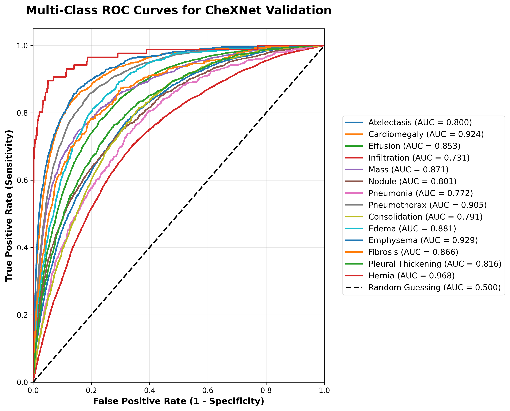

<div align="center">

# 🫁 CheXNet

### Radiologist-Level Chest X-Ray Classification

PyTorch reimplementation of the Stanford CheXNet paper — detecting **14 thoracic diseases** from a single chest X-ray using a fine-tuned 121-layer DenseNet.

[](https://python.org)
[](https://pytorch.org)
[](LICENSE)
[](https://nihcc.app.box.com/v/ChestXray-NIHCC)

</div>

---

## Paper

> **CheXNet: Radiologist-Level Pneumonia Detection on Chest X-Rays with Deep Learning**
> Rajpurkar et al., Stanford ML Group — [arXiv:1711.05225](https://arxiv.org/abs/1711.05225)

The paper fine-tunes a DenseNet-121 on the NIH ChestX-ray14 dataset and surpasses the average diagnostic performance of 4 practicing radiologists on pneumonia detection.

---

## Architecture

The model wraps a pretrained **DenseNet-121** backbone, replacing the final classification head with a single linear layer projecting to 14 outputs — one per pathology.

| Component | Detail |
|-----------|--------|
| Backbone | DenseNet-121 (ImageNet pretrained) |
| Classifier | Linear(1024 → 14) |
| Activation | Sigmoid (per-class probability) |
| Loss | BCEWithLogitsLoss |
| Optimizer | Adam & AdamW |
| Scheduler | ReduceLROnPlateau (factor=0.1, patience=2) |
| Multi-GPU | `torch.nn.DataParallel` |

---

## Project Structure

```
Chest-Xray-Classification/
├── src/
│   ├── model.py          # CheXNet model definition
│   ├── data_utils.py     # Dataset class + KaggleHub auto-download
│   ├── train.py          # Training loop with checkpoint resume
│   ├── evaluate.py       # AUC-ROC evaluation + ROC curves + Grad-CAM
│   └── config.py         # Main paths
├── Notebooks/            # Experiment notebooks
├── images/               # Output visualizations
├── requirements.txt
└── .gitignore
```

---

## Dataset

**NIH ChestX-ray14** — 112,120 frontal-view chest X-rays from 30,805 unique patients, weakly labeled with 14 pathology classes via NLP-mined radiology reports.

The dataset is auto-downloaded via `kagglehub` on first run. Train/val splits are derived from `Data_Entry_2017.csv`; the test split follows the official NIH `test_list.txt`.

**14 Pathology Classes:**

| | | | |
|--|--|--|--|
| Atelectasis | Cardiomegaly | Effusion | Infiltration |
| Mass | Nodule | Pneumonia | Pneumothorax |
| Consolidation | Edema | Emphysema | Fibrosis |
| Pleural Thickening | Hernia | | |

---

## Training Details

| Hyperparameter | Value |
|----------------|-------|
| Input size | 224 × 224 |
| Batch size | 32 |
| Augmentation | RandomCrop, RandomRotation ±15°, RandomHorizontalFlip |
| Normalization | ImageNet mean/std |
| Checkpoint | Saved every epoch; best model on val loss improvement |

Training automatically resumes from the latest checkpoint if one exists.

---

## Quick Start

**1. Clone**

```bash
git clone https://github.com/youssofhossam/Chest-Xray-Classification.git
cd Chest-Xray-Classification
```

**2. Install**

```bash
pip install -r requirements.txt
```

**3. Train**

```bash
cd src && python train.py
```

**4. Evaluate**

```bash
python evaluate.py
```

---

## Results

Models are evaluated per-class using **AUC-ROC**, consistent with the original paper. A score of **1.0** is perfect; **0.5** is random chance.

<div align="center">
  
  <br/>
  <em>ROC curves across all 14 pathology classes</em>
</div>

---

## 🔍 Explainability — Grad-CAM

The `GradCam` class in `evaluate.py` hooks into the final convolutional layer of DenseBlock4 to produce class-discriminative heatmaps, highlighting the image regions that drove each prediction.

This allows visual verification that the model is attending to clinically relevant anatomy rather than spurious artifacts.

---

## References

```bibtex
@article{rajpurkar2017chexnet,
  title   = {CheXNet: Radiologist-Level Pneumonia Detection on Chest X-Rays with Deep Learning},
  author  = {Rajpurkar, Pranav and Irvin, Jeremy and Zhu, Kaylie and Yang, Brandon and
             Mehta, Hershel and Duan, Tony and Ding, Daisy and Bagul, Aarti and
             Langlotz, Curtis and Shpanskaya, Katie and others},
  journal = {arXiv preprint arXiv:1711.05225},
  year    = {2017}
}
```

```bibtex
@inproceedings{wang2017chestx,
  title     = {ChestX-Ray8: Hospital-Scale Chest X-Ray Database and Benchmarks},
  author    = {Wang, Xiaosong and Peng, Yifan and Lu, Le and Lu, Zhiyong and
               Bagheri, Mohammadhadi and Summers, Ronald M},
  booktitle = {CVPR},
  year      = {2017}
}
```

---

<div align="center">
  Made with &nbsp;·&nbsp; PyTorch &nbsp;·&nbsp; DenseNet-121 &nbsp;·&nbsp; NIH ChestX-ray14
</div>